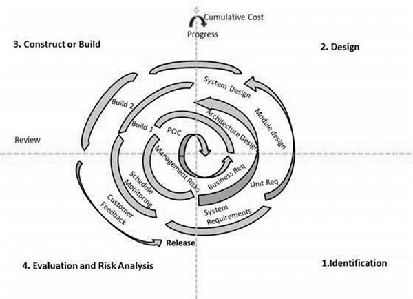

## Histoy of software
From machines like the ENIAC computer to smartphones and other devices, computing has seen incredibly rapid technological change. These hardware upgrades would mean little, without the accompanying birth and growth of software development. From operating systems and spreadsheets to mobile apps and games, you interact with software every time you use a computer.

**What Is Software?** 
Software is the interface between computer systems and the humans who use them. Software consists of programming instructions and data that tell the computer how to execute various tasks. The instructions are written in a higher-level language, which is easier to use for human programmers, and then converted into low-level machine code that the computer can directly understand.

**The Early Days of Software** 
Computer scientist Tom Kilburn is responsible for writing the world’s very first piece of software, at the University of Manchester in England. Kilburn and his colleague Freddie Williams had built one of the earliest computers, the Manchester Small-Scale Experimental Machine (also known as the “Baby”). The SSEM was programmed to perform mathematical calculations using machine code instructions. This first piece of software took “only” 52 minutes to correctly compute the greatest divisor of 2 to the power of 18 (262,144). For decades after this groundbreaking event, computers were programmed with punch cards in which holes denoted specific machine code instructions, if the dot was punched, it represented a zero, If it wasn’t, it was a one. These cards would later be replaced by reels of magnetic tape.. Fortran, one of the very first higher-level programming languages, was originally published in 1957. The next year, statistician John Tukey coined the word “software” in an article about computer programming. Other pioneering programming languages like Cobol, BASIC, Pascal and C arrived over the next two decades. During this time(1950's), a number of different types of programming software were created. Many of the early pieces of software weren’t available commercially, instead, computer users (mostly scientists and large businesses) often had to write their software themselves. This did have some advantages: the software was tailored for the specific needs of the user, and the user understood exactly what the software was doing. However, the disadvantages were much greater. Every business or lab had to have someone capable of programming the computer, and the software often couldn’t be traded to others because it was created for one specific computer system.

When computers became small enough to be sold to individuals, software became much more prevalent. Home users couldn’t program their computers themselves – the average person wouldn’t want to take the time to learn programming languages. Instead, the operating system was created. This specialized software ran the computer and launched other software as the user needed it. One of the earliest operating systems was MS-DOS, the operating system many of the early IBM computers used.

**Software Development Today** 
Today, software has become ubiquitous, even in places that you might not expect it, from crock pots to nuclear submarines. Some programming languages, like C and Cobol, have survived the test of time and are still in use. Other languages, such as Java and Python, are somewhat younger and have been used in countless software development projects. Still others, such as Apple’s Swift programming language for iOS or Go Open source, are relatively new and growing.

**The future of software development** 
With computers and tech now playing such a major part in all our lives, plus the impending growth of the Internet of Things (IoT), there’s little doubt that software will continue to shape our societies. Like many industry analysts believe we are now in the era of a fourth industrial revolution – a time when machines and the software that drives them will come to dominate.

Technology continues to evolve, and it’s difficult to say what the future of software entails. With services like the cloud computing now being offered, users don’t even need to download software to their computers they can run programs directly from the cloud with minimal installation. While artificial intelligence and self-aware robots seem like the stuff of science fiction, it’s actually possible that the computers of the future will be able to program themselves. Advanced programs may be able to develop code for new programs based on what the user enters or needs. They may even be able to create newer, improved versions of themselves or design entirely new operating systems. Perhaps we won’t even need to use a keyboard and mouse to use future software perhaps we’ll simply be able to think our commands to the computer!
# Software Process Models: 
A software process model is a simplified representation of a software process.

## Waterfall Model
In The Waterfall approach, the whole process of software development is divided into separate phases.  The next phase is started only after the defined set of goals are achieved for previous phase and it is signed off and phases do not overlap.

The sequential phases in Waterfall model are −

- Requirement Gathering and analysis − All possible requirements of the system to be developed are captured in this phase and documented in a requirement specification document.

- System Design − The requirement specifications from first phase are studied in this phase and the system design is prepared. This system design helps in specifying hardware and system requirements and helps in defining the overall system architecture.

- Implementation − With inputs from the system design, the system is first developed in small programs called units, which are integrated in the next phase. Each unit is developed and tested for its functionality, which is referred to as Unit Testing.

- Integration and Testing − All the units developed in the implementation phase are integrated into a system after testing of each unit. Post integration the entire system is tested for any faults and failures.

- Deployment of system − Once the functional and non-functional testing is done; the product is deployed in the customer environment or released into the market.

- Maintenance − There are some issues which come up in the client environment. To fix those issues, patches are released. Also to enhance the product some better versions are released. Maintenance is done to deliver these changes in the customer environment.

**Application** 

**Advantages** 
Some of the major advantages of the Waterfall Model are as follows −

- Simple and easy to understand and use

- Easy to manage due to the rigidity of the model. Each phase has specific deliverables and a review process.

- Phases are processed and completed one at a time.

- Works well for smaller projects where requirements are very well understood.

- Clearly defined stages.

- Well understood milestones.

- Easy to arrange tasks.

- Process and results are well documented.

**Disadvantages** 
Some of the major advantages of the Waterfall Model are as follows −

- No working software is produced until late during the life cycle.

- High amounts of risk and uncertainty.

- Not a good model for complex and object-oriented projects.

- Poor model for long and ongoing projects.

- Not suitable for the projects where requirements are at a moderate to high risk of changing. So, risk and uncertainty is high with this process model.

- It is difficult to measure progress within stages.

- Cannot accommodate changing requirements.

- Adjusting scope during the life cycle can end a project.

- Integration is done as a "big-bang. at the very end, which doesn't allow identifying any technological or business bottleneck or challenges early.

## Iterative Model

Iterative process starts with a simple implementation of a subset of the software requirements and iteratively enhances the evolving versions until the full system is implemented. At each iteration, design modifications are made and new functional capabilities are added.

**Application**

**Advantages** 
Some of the advantages of the Iterative and Incremental SDLC Model are as follows −

- Some working functionality can be developed quickly and early in the life cycle.

- Results are obtained early and periodically.

- Parallel development can be planned.

- Progress can be measured.

- Less costly to change the scope/requirements.

- Testing and debugging during smaller iteration is easy.

- Risks are identified and resolved during iteration; and each iteration is an easily managed milestone.

- Easier to manage risk - High risk part is done first.

- With every increment, operational product is delivered.

- Issues, challenges and risks identified from each increment can be utilized/applied to the next increment.

- Risk analysis is better.

- It supports changing requirements.

- Initial Operating time is less.

- Better suited for large and mission-critical projects.

- During the life cycle, software is produced early which facilitates customer evaluation and feedback.

**Disadvantages** 
Some of the disadvantages of the Iterative and Incremental SDLC Model are as follows −

- More resources may be required.

- Although cost of change is lesser, but it is not very suitable for changing requirements.

- More management attention is required.

- System architecture or design issues may arise because not all requirements are gathered in the beginning of the entire life cycle.

- Defining increments may require definition of the complete system.

- Not suitable for smaller projects.

- Management complexity is more.

- End of project may not be known which is a risk.

- Highly skilled resources are required for risk analysis.

- Projects progress is highly dependent upon the risk analysis phase.

## V-Model
Under the V-Model, the corresponding testing phase of the development phase is planned in parallel. So, there are Verification phases on one side of the ‘V’ and Validation phases on the other side. The Coding Phase joins the two sides of the V-Model.

**Verification Phases**

**Business Requirement Analysis** 
This is the first phase in the development cycle where the product requirements are understood from the customer’s perspective. This phase involves detailed communication with the customer to understand his expectations and exact requirement. The acceptance test design planning is done at this stage as business requirements can be used as an input for acceptance testing.

**System Design** 
Once you have the clear and detailed product requirements, it is time to design the complete system. The system design will have the understanding and detailing the complete hardware and communication setup for the product under development. The system test plan is developed based on the system design. Doing this at an earlier stage leaves more time for the actual test execution later.

**Architectural Design** 
Architectural specifications are understood and designed in this phase. Usually more than one technical approach is proposed and based on the technical and financial feasibility the final decision is taken. The system design is broken down further into modules taking up different functionality. This is also referred to as High Level Design.

**Module Design** 
In this phase, the detailed internal design for all the system modules is specified, referred to as Low Level Design (LLD). It is important that the design is compatible with the other modules in the system architecture and the other external systems. The unit tests are an essential part of any development process and helps eliminate the maximum faults and errors at a very early stage. These unit tests can be designed at this stage based on the internal module designs.

**Coding Phase**

The actual coding of the system modules designed in the design phase is taken up in the Coding phase. The best suitable programming language is decided based on the system and architectural requirements. The coding is performed based on the coding guidelines and standards. The code goes through numerous code reviews and is optimized for best performance before the final build is checked into the repository.

**Validation Phases**

The different Validation Phases in a V-Model are explained in detail below.

**Unit Testing** 
Unit tests designed in the module design phase are executed on the code during this validation phase. Unit testing is the testing at code level and helps eliminate bugs at an early stage, though all defects cannot be uncovered by unit testing.

**Integration Testing** 
Integration testing is associated with the architectural design phase. Integration tests are performed to test the coexistence and communication of the internal modules within the system.

**System Testing** 
System testing is directly associated with the system design phase. System tests check the entire system functionality and the communication of the system under development with external systems. Most of the software and hardware compatibility issues can be uncovered during this system test execution.

**Acceptance Testing** 
Acceptance testing is associated with the business requirement analysis phase and involves testing the product in user environment. Acceptance tests uncover the compatibility issues with the other systems available in the user environment. It also discovers the non-functional issues such as load and performance defects in the actual user environment.

**Application**

**Advantages**

The advantages of the V-Model method are as follows −

- This is a highly-disciplined model and Phases are completed one at a time.

- Works well for smaller projects where requirements are very well understood.

- Simple and easy to understand and use.

- Easy to manage due to the rigidity of the model. Each phase has specific deliverables and a review process.

**Disadvantages**

The disadvantages of the V-Model method are as follows −

- High risk and uncertainty.

- Not a good model for complex and object-oriented projects.

- Poor model for long and ongoing projects.

- Not suitable for the projects where requirements are at a moderate to high risk of changing.

- Once an application is in the testing stage, it is difficult to go back and change a functionality.

- No working software is produced until late during the life cycle.

## Spiral Model
The spiral model has four phases. A software project repeatedly passes through these phases in iterations called Spirals.

**Identification** 
This phase starts with gathering the business requirements in the baseline spiral. In the subsequent spirals as the product matures, identification of system requirements, subsystem requirements and unit requirements are all done in this phase. This phase also includes understanding the system requirements by continuous communication between the customer and the system analyst. At the end of the spiral, the product is deployed in the identified market.

**Design** 
The Design phase starts with the conceptual design in the baseline spiral and involves architectural design, logical design of modules, physical product design and the final design in the subsequent spirals.

**Construct or Build** 
The Construct phase refers to production of the actual software product at every spiral. In the baseline spiral, when the product is just thought of and the design is being developed a POC (Proof of Concept) is developed in this phase to get customer feedback.

**Evaluation and Risk Analysis** 
Risk Analysis includes identifying, estimating and monitoring the technical feasibility and management risks, such as schedule slippage and cost overrun. After testing the build, at the end of first iteration, the customer evaluates the software and provides feedback.

**Advantages**

The advantages of the Spiral SDLC Model are as follows −

- Changing requirements can be accommodated.

- Allows extensive use of prototypes.

- Requirements can be captured more accurately.

- Users see the system early.

- Development can be divided into smaller parts and the risky parts can be developed earlier which helps in better risk management.

**Disadvantages**

The disadvantages of the Spiral SDLC Model are as follows −

- Management is more complex.

- End of the project may not be known early.

- Not suitable for small or low risk projects and could be expensive for small projects.

- Process is complex

- Spiral may go on indefinitely.

- Large number of intermediate stages requires excessive documentation.

## Agile model
Agile SDLC model is a combination of iterative and incremental process models with focus on process adaptability and customer satisfaction by rapid delivery of working software product. Agile Methods break the product into small incremental builds. These builds are provided in iterations. Each iteration typically lasts from about one to three weeks. Every iteration involves cross functional teams working simultaneously on various areas like −

- Planning
- Requirements Analysis
- Design
- Coding
- Unit Testing and
- Acceptance Testing.

The most popular Agile methods include Rational Unified Process (1994), Scrum (1995), Crystal Clear, Extreme Programming (1996), Adaptive Software Development, Feature Driven Development, and Dynamic Systems Development Method (DSDM) (1995).

Following are the Agile Manifesto principles −

- Individuals and interactions − In Agile development, self-organization and motivation are important, as are interactions like co-location and pair programming.

- Working software − Demo working software is considered the best means of communication with the customers to understand their requirements, instead of just depending on documentation.

- Customer collaboration − As the requirements cannot be gathered completely in the beginning of the project due to various factors, continuous customer interaction is very important to get proper product requirements.

- Responding to change − Agile Development is focused on quick responses to change and continuous development.

**Advantages**

The advantages of the Agile Model are as follows −

- Is a very realistic approach to software development.

- Promotes teamwork and cross training.

- Functionality can be developed rapidly and demonstrated.

- Resource requirements are minimum.

- Suitable for fixed or changing requirements

- Delivers early partial working solutions.

- Good model for environments that change steadily.

- Minimal rules, documentation easily employed.

- Enables concurrent development and delivery within an overall planned context.

- Little or no planning required.

- Easy to manage.

- Gives flexibility to developers.

**Disadvantages**

The disadvantages of the Agile Model are as follows −

- Not suitable for handling complex dependencies.

- More risk of sustainability, maintainability and extensibility.

- An overall plan, an agile leader and agile PM practice is a must without which it will not work.

- Strict delivery management dictates the scope, functionality to be delivered, and adjustments to meet the deadlines.

- Depends heavily on customer interaction, so if customer is not clear, team can be driven in the wrong direction.

- There is a very high individual dependency, since there is minimum documentation generated.

- Transfer of technology to new team members may be quite challenging due to lack of documentation.

## RAD Model
RAD model distributes the analysis, design, build and test phases into a series of short, iterative development cycles.

Following are the various phases of the RAD Model −

**Business Modelling** 
The business model for the product under development is designed in terms of flow of information and the distribution of information between various business channels. A complete business analysis is performed to find the vital information for business, how it can be obtained, how and when is the information processed and what are the factors driving successful flow of information.

**Data Modelling** 
The information gathered in the Business Modelling phase is reviewed and analyzed to form sets of data objects vital for the business. The attributes of all data sets is identified and defined. The relation between these data objects are established and defined in detail in relevance to the business model.

**Process Modelling** 
The data object sets defined in the Data Modelling phase are converted to establish the business information flow needed to achieve specific business objectives as per the business model. The process model for any changes or enhancements to the data object sets is defined in this phase. Process descriptions for adding, deleting, retrieving or modifying a data object are given.

**Application Generation** 
The actual system is built and coding is done by using automation tools to convert process and data models into actual prototypes.

**Testing and Turnover** 
The overall testing time is reduced in the RAD model as the prototypes are independently tested during every iteration. However, the data flow and the interfaces between all the components need to be thoroughly tested with complete test coverage. Since most of the programming components have already been tested, it reduces the risk of any major issues.

**Advantages**

The advantages of the RAD Model are as follows −

- Changing requirements can be accommodated.

- Progress can be measured.

- Iteration time can be short with use of powerful RAD tools.

- Productivity with fewer people in a short time.

- Reduced development time.

- Increases reusability of components.

- Quick initial reviews occur.

- Encourages customer feedback.

- Integration from very beginning solves a lot of integration issues.

**Disadvantages**

The disadvantages of the RAD Model are as follows −

- Dependency on technically strong team members for identifying business requirements.

- Only system that can be modularized can be built using RAD.

- Requires highly skilled developers/designers.

- High dependency on Modelling skills.

- Inapplicable to cheaper projects as cost of Modelling and automated code generation is very high.

- Management complexity is more.

- Suitable for systems that are component based and scalable.

- Requires user involvement throughout the life cycle.

- Suitable for project requiring shorter development times.

## Big Bang Model
The Big Bang model is an SDLC model where we do not follow any specific process. The development just starts with the required money and efforts as the input, and the output is the software developed which may or may not be as per customer requirement.

> This model is ideal for small projects with one or two developers working together and is also useful for academic or practice projects. It is an ideal model for the product where requirements are not well understood and the final release date is not given.

**Advanatges**

The advantages of the Big Bang Model are as follows −

- This is a very simple model

- Little or no planning required

- Easy to manage

- Very few resources required

- Gives flexibility to developers

- It is a good learning aid for new comers or students.

**Disadvantages**

The disadvantages of the Big Bang Model are as follows −

- Very High risk and uncertainty.

- Not a good model for complex and object-oriented projects.

- Poor model for long and ongoing projects.

- Can turn out to be very expensive if requirements are misunderstood.

**REFERENCES**

- https://www.tutorialspoint.com/sdlc/sdlc_bigbang_model.htm
- https://medium.com/@micahyost/a-brief-history-of-software-development-f67a6e6ddae0
- https://bscdesigner.com/software-history.htm
- https://blogs.oregonstate.edu/articles/a-short-history-of-software-development/